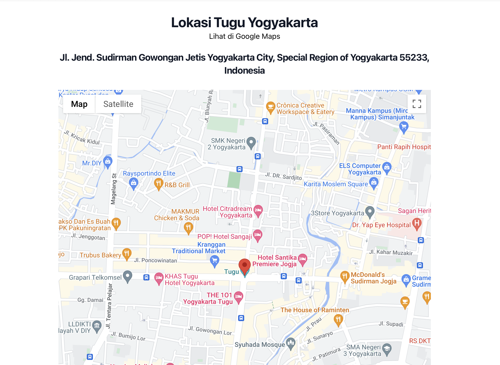

<!-- PROJECT LOGO -->
<br />
<div align="center">
  <a href="https://github.com/jeremykenneth7/GoogleMapsAPI-ReactJS-Tailwind">
    
  </a>

<h3 align="center">GoogleMapsAPI-ReactJS-Tailwind
</h3>

  <p align="center">
    Integrasi antara GoogleMaps dan ReactJS dengan menggunakan GoogleMapsAPI dan Tailwind
    <br />
    <a href="https://github.com/jeremykenneth7/GoogleMapsAPI-ReactJS-Tailwind"><strong>Explore the docs »</strong></a>
    <br />
    <br />
    <a href="https://github.com/jeremykenneth7/GoogleMapsAPI-ReactJS-Tailwind">View Demo</a>
    ·
    <a href="https://github.com/jeremykenneth7/GoogleMapsAPI-ReactJS-Tailwind/issues">Report Bug</a>
    ·
    <a href="https://github.com/jeremykenneth7/GoogleMapsAPI-ReactJS-Tailwind/issues">Request Feature</a>
  </p>
</div>


<!-- GETTING STARTED -->
## Getting Started

To get a local copy up and running follow these simple example steps.

### Installation


1. Clone the repo
   ```sh
   git clone https://github.com/jeremykenneth7/GoogleMapsAPI-ReactJS-Tailwind.git
   ```
2. Install npm i @react-google-maps/api

3. Install Tailwind CSS 
  npm install -D tailwindcss
  npx tailwindcss init
  
4. Configure your template paths

Add the paths to all of your template files in your tailwind.config.js file.
tailwind.config.js

/** @type {import('tailwindcss').Config} */
module.exports = {
  content: [
    "./src/**/*.{js,jsx,ts,tsx}",
  ],
  theme: {
    extend: {},
  },
  plugins: [],
}
Add the Tailwind directives to your CSS

5. Add the @tailwind directives for each of Tailwind’s layers to your ./src/index.css file.
index.css

@tailwind base;
@tailwind components;
@tailwind utilities;
Start your build process

6. Run your build process with npm run start.


<p align="right">(<a href="#readme-top">back to top</a>)</p>


<!-- CONTRIBUTING -->
## Contributing

Contributions are what make the open source community such an amazing place to learn, inspire, and create. Any contributions you make are **greatly appreciated**.

If you have a suggestion that would make this better, please fork the repo and create a pull request. You can also simply open an issue with the tag "enhancement".
Don't forget to give the project a star! Thanks again!

1. Fork the Project
2. Create your Feature Branch (`git checkout -b feature/GoogleMapsAPI-ReactJS-Tailwind`)
3. Commit your Changes (`git commit -m 'Add some GoogleMapsAPI-ReactJS-Tailwind'`)
4. Push to the Branch (`git push origin feature/GoogleMapsAPI-ReactJS-Tailwind`)
5. Open a Pull Request

<p align="right">(<a href="#readme-top">back to top</a>)</p>


<!-- CONTACT -->
## Contact

Jeremy Kenneth - jeremykenneth7@gmail.com

Project Link: [https://github.com/jeremykenneth7/GoogleMapsAPI-ReactJS-Tailwind](https://github.com/jeremykenneth7/GoogleMapsAPI-ReactJS-Tailwind)

<p align="right">(<a href="#readme-top">back to top</a>)</p>

